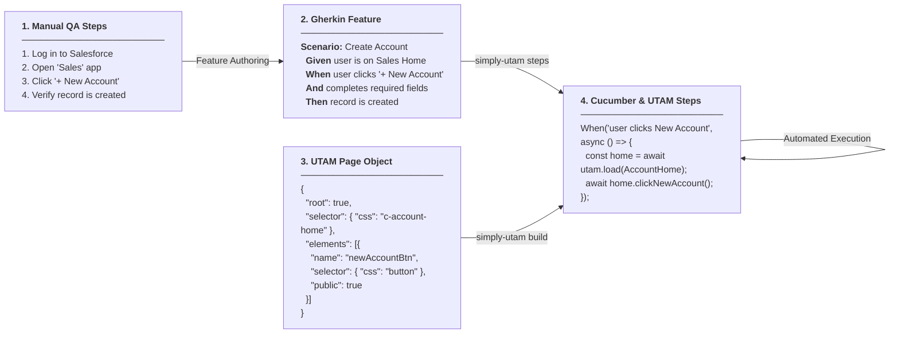

# Simply UTAM

[](https://opensource.org/licenses/Apache-2.0)

Simply UTAM is a set of libraries built by [SimplySF](https://github.com/SimplySF) for writing
[UTAM](https://utam.dev/) UI tests against Salesforce: logging the test browser in to an org the
Salesforce CLI has already authorized, opening Lightning pages directly, and seeing what a UTAM
locator actually resolved to.

## Packages

| Package                                                   | Description                                                          |
| --------------------------------------------------------- | -------------------------------------------------------------------- |
| [`@simplysf/simply-utam`](packages/simply-utam)           | Developer CLI executable and convenience re-exports                  |
| [`@simplysf/simply-utam-core`](packages/simply-utam-core) | Org authentication, Lightning navigation, and UTAM debugging helpers |

## Overview & Workflow

SimplyUTAM bridges human-authored test requirements, declarative Salesforce UI components, generated UTAM page objects, and automated step implementations into an automated pipeline:



## Installation

```sh
npm install --save-dev @simplysf/simply-utam-core
# or for the developer CLI:
npm install --save-dev @simplysf/simply-utam
```

Requires Node.js 22 or later. See the [package README](packages/simply-utam-core/README.md) for usage
and the API reference.

## Getting Started

This walkthrough guides you through setting up SimplyUTAM in an existing Salesforce DX project and running a "Hello World" Cucumber UI test.

### 1. Initialize Configuration

Run the interactive scaffolding command in your Salesforce DX project root:

```sh
npx simply-utam init
```

This command inspects your Salesforce project and non-destructively scaffolds:
- `generator.config.json` — Maps LWC root rules and namespace paths for `utam-generate`.
- `utam.config.json` — Configures the UTAM compiler page object output directory.
- `wdio.conf.mjs` — Starter WebdriverIO runner configuration wired with `wdio-utam-service`.
- `.utam/namespace-map.json` — Cross-package namespace rewriting rules.
- `<sourceDir>/test/utam/` — Starter "Hello World" Cucumber smoke test (`features/hello.feature` and `step_definitions/hello.steps.mjs`), scaffolded automatically unless an existing `test/utam` directory is found.
- `package.json` — Injects standard Wireit tasks (`build:utam-rules`, `build:utam-generate`, `build:utam-overrides`, `build:utam-rewrite-namespaces`, `build:utam`, and `test:ui`).

> **Tip:** You can preview planned file modifications beforehand with `npx simply-utam init --dry-run`.

### 2. Install Missing Dependencies

If your project does not already have the required test runners and UTAM tooling installed, `simply-utam init` will display the missing recommended devDependencies. Install them with:

```sh
npm install --save-dev wireit utam salesforce-pageobjects wdio-utam-service chromedriver @wdio/cli @wdio/local-runner @wdio/cucumber-framework @wdio/spec-reporter
```

### 3. Review and Customize Configuration

Review the generated files and adjust them to your project's structure:

1. **`.utam/namespace-map.json`:**
   If your project uses packaging namespaces or consumes shared component libraries, define prefix replacements here:
   ```json
   {
     "my-app/pageObjects/shared": "shared-components-pageobjects/pageObjects/shared"
   }
   ```
   *(If you are not rewriting namespaces across packages, an empty object `{}` is fine; `simply-utam rewrite` will gracefully skip without error).*

2. **`wdio.conf.mjs`:**
   Verify `specs` and `cucumberOpts.require` match where you store your Cucumber features and steps (defaults to `{{sourceDir}}/**/test/*.feature` and `{{sourceDir}}/**/test/*.steps.mjs`). Note that `'wdio:enforceWebDriverClassic': true` is pre-configured to guarantee reliable Shadow DOM element querying across Salesforce Lightning components.

### 4. Authorize Your Target Org

SimplyUTAM authenticates through the Salesforce CLI's local auth store — no credentials or passwords in test files or environment repositories.

Authenticate your scratch org or sandbox:

```sh
# Authenticate an existing org:
sf org login web --alias my-scratch-org

# Or create a new scratch org:
sf org create scratch --definition-file config/project-scratch-def.json --alias my-scratch-org --set-default
```

Set the target username or alias in the `UTAM_USERNAME` environment variable:

```sh
# macOS / Linux:
export UTAM_USERNAME=my-scratch-org

# Windows (PowerShell):
$env:UTAM_USERNAME="my-scratch-org"
```

### 5. Review the Scaffolded "Hello World" Cucumber Test

The `init` command scaffolds a ready-to-run smoke test in `<sourceDir>/test/utam/` (unless that folder already existed):

```text
<sourceDir>/test/utam/
├── features/
│   └── hello.feature
└── step_definitions/
    └── hello.steps.mjs
```

1. **Feature definition** (`<sourceDir>/test/utam/features/hello.feature`):
   ```gherkin
   Feature: Salesforce UI Smoke Test

     Scenario: Log in and navigate to Salesforce Home
       Given I open the Salesforce application "Sales"
   ```

2. **Step definition** (`<sourceDir>/test/utam/step_definitions/hello.steps.mjs`):
   ```javascript
   import { Given } from '@wdio/cucumber-framework';
   import { goToApplication } from '@simplysf/simply-utam';

   Given('I open the Salesforce application {string}', async (appName) => {
     // Authenticates via Salesforce CLI frontdoor URL and opens the application home page
     await goToApplication(appName);
   });
   ```

You can customize the application name (e.g. replace `"Sales"` with your target app name). As your test suite grows, run `npx simply-utam steps` at any time to scan new `.feature` files, identify undefined steps, and scaffold missing step skeletons with typed Cucumber expressions.

### 6. Run the Test

Execute the UI test using the Wireit task:

```sh
npm run test:ui
```

Wireit automatically resolves and executes all required compilation steps in the dependency graph before launching WebdriverIO:
`build:utam-rules` ➔ `build:utam-generate` ➔ `build:utam-overrides` ➔ `build:utam-rewrite-namespaces` ➔ `build:utam` ➔ `wdio run wdio.conf.mjs`.

## Contributing

Contributions are welcome. See [CONTRIBUTING.md](CONTRIBUTING.md) for the repo structure, how to set
up and build the project, our commit conventions, and how to submit a pull request. Please also read
our [Code of Conduct](CODE_OF_CONDUCT.md).

## Issues

Please report bugs or request features by [opening an issue](https://github.com/SimplySF/simply-utam/issues)
in this repository.

## License

Licensed under the [Apache-2.0](LICENSE.txt) license.
