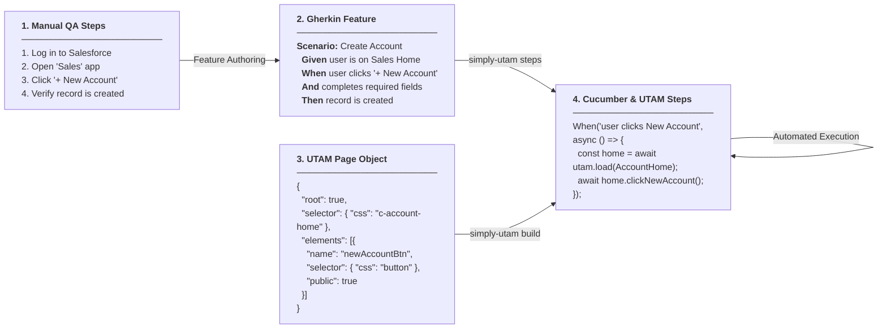
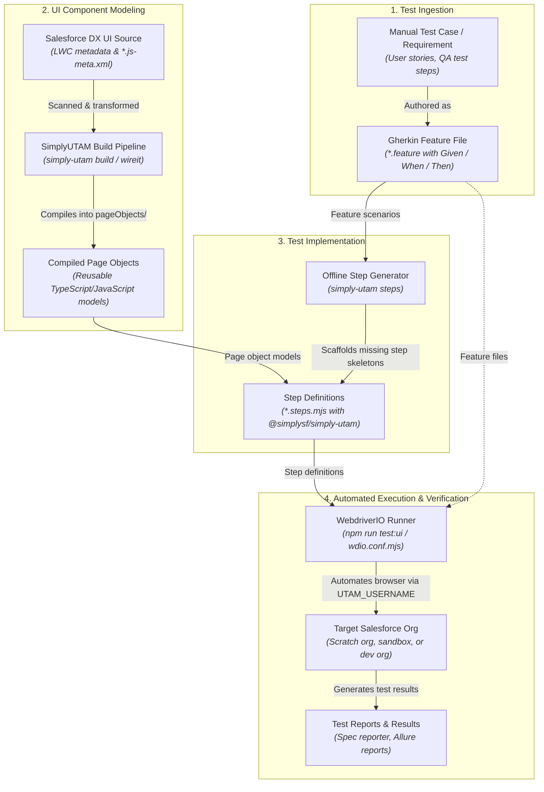
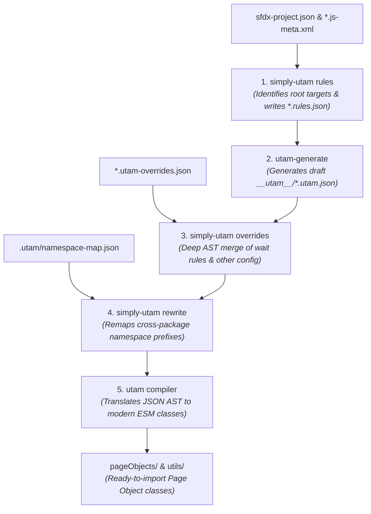

# SimplyUTAM: Solution Design & Architecture

## 1. Executive Summary & Vision

**SimplyUTAM** (`@simplysf/simply-utam`) is an enterprise-grade tooling and runtime framework designed to streamline and automate UI testing for Salesforce Lightning Web Components (LWC) and Experience Cloud applications. It unifies:

1. **Automated UTAM Build Pipelines**: Root LWC rule generation, fine-grained JSON schema overrides, and multi-package namespace remapping.
2. **Offline Cucumber Step Generation**: Clean scaffolding of missing Gherkin step definitions without requiring live platform connections or runtime loader hacks.
3. **Runtime Test Environment & Navigation**: Headless frontdoor authentication, secure Experience Cloud SSO routing, and admin user impersonation.
4. **Zero-Config Developer CLI**: A CLI (`simply-utam`) that scaffolds new projects (`simply-utam init`), manages build steps, and integrates with modern task orchestrators like Wireit.

The project is architected as an open-source TypeScript monorepo under the **SimplySF** ecosystem, following the design principles, conventions, and developer ergonomics established in [SimplySF/simply-atlassian](https://github.com/SimplySF/simply-atlassian).

---

## 2. System Architecture & End-to-End Workflow

### 2.1 Conceptual Translation Flow

SimplyUTAM bridges human-authored test requirements, declarative Salesforce UI components, generated UTAM page objects, and automated step implementations:



---

### 2.2 End-to-End Testing Lifecycle

The diagram below outlines the complete lifecycle from capturing manual test requirements to executing automated tests against Salesforce:



---

### 2.3 Multi-Stage Page Object Build Pipeline

To support customizable and distributable page objects across complex multi-package repositories, the build system transforms metadata and schemas through a deterministic multi-stage pipeline:



1. **Rules Generation (`simply-utam rules`)**: Scans LWC component directories for `*.js-meta.xml` files. Components targeting page-level layouts (`lightning__AppPage`, `lightning__HomePage`, `lightning__RecordPage`, `lightningCommunity__Page`) are marked as root page objects and assigned namespace-aware CSS selectors in `<component>.rules.json`.
2. **Draft Schema Generation (`utam-generate`)**: Converts component HTML templates into draft UTAM JSON schemas in `__utam__/`.
3. **AST Overrides Merging (`simply-utam overrides`)**: Traverses generated schemas and deep-merges developer-defined UTAM configuration from `*.utam-overrides.json` without destroying compiler-generated structures.
4. **Namespace Rewriting (`simply-utam rewrite`)**: Resolves cross-package collisions by mapping component type prefixes according to `.utam/namespace-map.json`.
5. **UTAM Compilation (`utam`)**: Translates finalized declarative JSON schemas and imperative JavaScript extensions into modern ES module page object classes in `pageObjects/`.

---

## 3. Package Architecture (Monorepo)

The repository is managed using **pnpm workspaces** and **Lerna**, structured into two focused packages:

```text
simply-utam/
├── .github/                      # CI/CD workflows (build, test, lint, release)
├── .husky/                       # Git hooks (pre-commit, commit-msg)
├── docs/                         # Documentation
│   └── design/
│       ├── solution-design.md    # This architecture document
│── packages/
│   ├── simply-utam-core/         # Core engine & runtime library (@simplysf/simply-utam-core)
│   │   ├── src/
│   │   │   ├── discovery/        # sfdx-project.json & LWC scanner
│   │   │   ├── rules/            # create-lwc-rules generator
│   │   │   ├── overrides/        # apply-utam-overrides merger
│   │   │   ├── namespaces/       # rewrite-utam-namespaces mapper
│   │   │   ├── steps/            # generate-steps scaffold generator
│   │   │   ├── runtime/          # TestEnvironment, loginAsUser, navigation
│   │   │   ├── scaffold/         # Config templates & package.json mutator
│   │   │   └── index.ts          # Public library exports
│   │   ├── templates/            # Scaffolding templates
│   │   ├── test/                 # Vitest unit & integration test suites
│   │   ├── package.json
│   │   └── tsconfig.json
│   │
│   └── simply-utam/              # CLI executable package (@simplysf/simply-utam)
│       ├── bin/
│       │   ├── run.js            # CLI executable entry point
│       │   └── dev.js            # CLI dev entry point
│       ├── src/
│       │   ├── commands/         # init, rules, overrides, rewrite, steps, build
│       │   ├── pipeline-runner.ts# Multi-stage process runner (spawns utam-generate & utam)
│       │   └── index.ts
│       ├── test/
│       ├── package.json
│       └── tsconfig.json
│
├── .editorconfig
├── .lintstagedrc.mjs
├── .prettierrc.mjs
├── commitlint.config.mjs
├── eslint.config.mjs
├── lerna.json
├── package.json
├── pnpm-lock.yaml
├── pnpm-workspace.yaml
├── README.md
├── tsconfig.json
└── vitest.config.ts
```

---

## 4. Package Responsibilities & Boundaries

### 4.1 `@simplysf/simply-utam-core`

The core library contains all the business logic, file transformations, environment abstractions, and step discovery mechanisms. It has **no CLI dependencies** (no `@oclif/core`, no inquirer, no console prompts, no direct process.exit, no stdout/stderr writes). It is a pure library designed for programmatic consumption.

#### Core Modules:

1. **`discovery`**:
   - Inspects `sfdx-project.json` to identify package directories (e.g., `force-app`, `sfdx-source`, or custom multi-package paths), default targets, and packaging namespaces (`namespace` property).
   - Reads `package.json` to determine the consumer project's package name and existing dependencies.
   - Discovers all LWC component directories (`**/lwc/*/`) across all resolved package directories.

2. **`rules`**:
   - Parses `*.js-meta.xml` files for LWC components.
   - Detects root targets (`lightningCommunity__Page`, `lightning__AppPage`, `lightning__HomePage`, `lightning__RecordPage`).
   - Automatically generates or updates `<componentName>.rules.json` designating root components and CSS selectors.
   - Leverages `discovery` to determine the component prefix: if `sfdx-project.json` defines a packaging namespace, use `<namespace>-<kebab-name>`; otherwise default to standard `c-<kebab-name>`.
   - Defaults to scanning all discovered package directories when `--source` is not explicitly specified.
   - Supports `--dry-run` and formatted output.

3. **`overrides`**:
   - Discovers `*.utam-overrides.json` definition files across all discovered package directories (or explicit `--source`).
   - Walks generated UTAM JSON AST structures (supporting nested element hierarchies, shadow DOM roots).
   - Deeply merges custom developer wait conditions and visibility rules without destroying generated schema fields.
   - Preserves original file indentation (2-space, 4-space, tabs).

4. **`namespaces`**:
   - Reads mapping configuration from `--config` (default: `.utam/namespace-map.json`).
   - If the configuration file is missing or contains an empty mapping object, gracefully logs an informational notice and exits with code 0 without failing the build.
   - Sorts namespace prefix mappings in descending order of length so longer, more specific prefixes match before shorter ones.
   - Recursively traverses generated `*.utam.json` files and rewrites component references in element `type` and compose `apply` properties.
   - Resolves multi-package namespace collisions across distributed UTAM libraries.

5. **`steps` (Step Generator Engine)**:
   - Eliminates legacy Node ESM loader hook hacks (`register-loader.js` / `resolver-loader.mjs`).
   - Operates as a 100% offline static AST and expression matching engine:
     - Parses Gherkin `.feature` files (scenarios, scenario outlines, backgrounds, and rules) using `@cucumber/gherkin`.
     - Statically extracts registered step patterns from existing step definition files (`*.steps.{js,mjs,ts}`).
     - Compiles defined patterns using `@cucumber/cucumber-expressions` (`CucumberExpression`, `RegularExpression`, `ParameterTypeRegistry`) to handle parameterized steps (`{string}`, `{int}`, custom parameter types, and regular expressions).
     - Matches each Gherkin scenario step against registered expressions to accurately detect true undefined steps without false positives on parameterized steps.
     - Deduplicates missing steps across all feature files.
     - Leverages `CucumberExpressionGenerator` to automatically generate standard Cucumber expressions with appropriate parameter types (`{string}`, `{int}`) and typed argument lists.
     - Generates clean, typed step templates using `@wdio/cucumber-framework` (`Given('...', async (...) => { ... });`).
     - Formats output using Prettier.

6. **`runtime` (Test Environment, Navigation & Debug Helpers)**:
   - **`TestEnvironment`**:
     - **Lazy Initialization**: Does not connect to Salesforce at module load time. Connection occurs on first access via a lazy singleton (`getTestEnvironment()`) or explicit invocation.
     - Authenticates using `@salesforce/core` Org connections via `UTAM_USERNAME`. Supports constructor options (`{ username?: string }`) for programmatic instantiation.
     - Validates domain security against trusted Salesforce patterns:
       ```typescript
       export const DEFAULT_ALLOWED_HOST_PATTERNS = [
         /\.salesforce\.com$/i,
         /\.site\.com$/i,
         /\.salesforce-sites\.com$/i,
         /\.force\.com$/i,
       ];
       ```
       along with the org instance URL and optional `UTAM_ALLOWED_DOMAINS` wildcards.
     - Resolves Community / Experience Cloud Network IDs and secure site URLs.
     - Constructs Frontdoor bypass URLs (`/secur/frontdoor.jsp?sid=...` or `/services/oauth2/singleaccess`).
   - **`navigation` & Debug Helpers**:
     - Provides first-class WebdriverIO typing against a lightweight `NavigableBrowser` interface (with ambient global `browser` or optional browser parameter defaulting to `globalThis.browser`), enabling isolated unit testing without a live browser session.
     - `goToLoginUrl(returnUrl?: string, browserInstance?: NavigableBrowser)`
     - `goToExperiencePage(sitePrefix: string, pageName: string, browserInstance?: NavigableBrowser)`
     - `loginAsUser(username: string, returnUrl?: string, browserInstance?: NavigableBrowser)`: User impersonation via admin session and `/servlet/servlet.su`.
     - `loginAsExperienceUser(username: string, sitePrefix: string, pageName: string, browserInstance?: NavigableBrowser)`: Combines user impersonation with `/servlet/networks/switch` network switching.
     - `goToApplication(applicationName: string, browserInstance?: NavigableBrowser)`
     - `goToCreateNewRecord(applicationName: string, objectName: string, browserInstance?: NavigableBrowser)`
     - `goToRecord(applicationName: string, recordId: string, browserInstance?: NavigableBrowser)`
     - `goToRelatedList(applicationName: string, recordId: string, relatedListName: string, browserInstance?: NavigableBrowser)`
     - `logUtamHtml(utamObj: unknown)`: Debug utility for inspecting UTAM element shadow DOM markup.

7. **`scaffold`**:
   - Programmatically generates starter configs: `generator.config.json`, `utam.config.json`, `wdio.conf.mjs`, and `.utam/namespace-map.json`.
   - Scaffolds a starter smoke test in `<sourceDir>/test/utam/` (`hello.feature` and `hello.steps.mjs`) unless an existing `test/utam` directory is present.
   - Modifies consumer `package.json` non-destructively to inject standard Wireit tasks, scripts, and verify required devDependencies.

---

### 4.2 `@simplysf/simply-utam` (CLI)

The CLI wraps `@simplysf/simply-utam-core` into a modern developer command-line tool and re-exports runtime helpers.

#### Command Suite:

- **`simply-utam init`**:
  - Auto-detected scaffolding of a Salesforce project for UTAM.
  - Inspects `sfdx-project.json` to customize paths in generated configs.
  - Scaffolds config files, starter tests, sets up Wireit pipelines, and verifies devDependencies.
- **`simply-utam rules`**:
  - Executes the rules generator.
  - Options: `-s, --source <paths...>` (defaults to all discovered package directories), `-d, --dry-run`, `-v, --verbose`.
- **`simply-utam overrides`**:
  - Merges `*.utam-overrides.json` into generated UTAM schemas.
  - Options: `-s, --source <paths...>` (defaults to all discovered package directories), `-d, --dry-run`, `-v, --verbose`.
- **`simply-utam rewrite`**:
  - Rewrites namespace prefixes across compiled UTAM page objects.
  - Options: `-s, --source <paths...>` (defaults to all discovered package directories), `-c, --config <path>` (defaults to `.utam/namespace-map.json`), `-d, --dry-run`, `-v, --verbose`.
  - Exits cleanly (status 0) with a notice if config is missing or empty.
- **`simply-utam steps`**:
  - Scaffolds missing Cucumber step definitions.
  - Options: `-f, --features <globs...>`, `-s, --steps <globs...>`, `-o, --output <path>`, `-d, --dry-run`, `-v, --verbose`.
- **`simply-utam build`**:
  - Standalone convenience runner executing the complete pipeline sequentially: `rules -> utam-generate -> overrides -> rewrite -> utam compiler`.
  - Locates local `node_modules/.bin/utam-generate` and `node_modules/.bin/utam` binaries, validates configuration files, and executes each stage.
  - Note: Wireit is the recommended mechanism for granular task caching in everyday developer workflows; `simply-utam build` provides a self-contained single-command pipeline.

#### Re-exports:

- `@simplysf/simply-utam` re-exports the entire `@simplysf/simply-utam-core` helper surface (`loginAsUser`, `goToExperiencePage`, etc.) so consumers can optionally install only `@simplysf/simply-utam`.

#### Standard CLI Flags (matching SimplySF conventions):

- `--dry-run`: Preview modifications without writing to disk.
- `--json`: Output structured JSON (ideal for CI/CD and AI agent tools).
- `--verbose`: Detailed diagnostic logging.

---

### 4.3 Subpath Exports Configuration (`@simplysf/simply-utam-core`)

`@simplysf/simply-utam-core` provides fine-grained package subpath exports in `package.json`:

```json
{
  "name": "@simplysf/simply-utam-core",
  "exports": {
    ".": {
      "types": "./lib/index.d.ts",
      "default": "./lib/index.js"
    },
    "./discovery": {
      "types": "./lib/discovery/index.d.ts",
      "default": "./lib/discovery/index.js"
    },
    "./rules": {
      "types": "./lib/rules/index.d.ts",
      "default": "./lib/rules/index.js"
    },
    "./overrides": {
      "types": "./lib/overrides/index.d.ts",
      "default": "./lib/overrides/index.js"
    },
    "./namespaces": {
      "types": "./lib/namespaces/index.d.ts",
      "default": "./lib/namespaces/index.js"
    },
    "./steps": {
      "types": "./lib/steps/index.d.ts",
      "default": "./lib/steps/index.js"
    },
    "./scaffold": {
      "types": "./lib/scaffold/index.d.ts",
      "default": "./lib/scaffold/index.js"
    }
  }
}
```

---

## 5. Technical Stack & Conventions

Following [SimplySF/simply-atlassian](https://github.com/SimplySF/simply-atlassian):

| Category                 | Technology / Convention                                   |
| ------------------------ | --------------------------------------------------------- |
| **Runtime**              | Node.js >= 22 (LTS)                                       |
| **Module Format**        | Pure ESM (`"type": "module"`, `.mjs` config files)        |
| **Language**             | TypeScript 5+ (`Node16` module resolution, strict mode)   |
| **Package Manager**      | `pnpm` (v11+) with workspaces                             |
| **Monorepo Manager**     | Lerna v10 (independent versioning)                        |
| **Testing**              | Vitest with coverage and isolated mocks                   |
| **Linting & Formatting** | ESLint 10+ (Flat Config), Prettier 3+                     |
| **Git Quality Gates**    | Husky, lint-staged, Commitlint (Conventional Commits)     |
| **CLI Framework**        | [oclif](https://oclif.io/) (`@oclif/core`)                |

---

## 6. Consumer Integration Pattern

When consumed in a Salesforce project, the consumer workflow is clean and automated:

```json
{
  "scripts": {
    "build:utam-rules": "wireit",
    "build:utam-generate": "wireit",
    "build:utam-overrides": "wireit",
    "build:utam-rewrite-namespaces": "wireit",
    "build:utam": "wireit",
    "test:ui": "wireit"
  },
  "wireit": {
    "build:utam-rules": {
      "command": "simply-utam rules"
    },
    "build:utam-generate": {
      "command": "utam-generate -c generator.config.json",
      "dependencies": ["build:utam-rules"]
    },
    "build:utam-overrides": {
      "command": "simply-utam overrides",
      "dependencies": ["build:utam-generate"]
    },
    "build:utam-rewrite-namespaces": {
      "command": "simply-utam rewrite -c .utam/namespace-map.json",
      "dependencies": ["build:utam-overrides"]
    },
    "build:utam": {
      "command": "utam -c utam.config.json",
      "files": ["**/__utam__/**/*.utam.json", "**/__utam__/**/*.utam.js"],
      "output": ["pageObjects"],
      "dependencies": ["build:utam-rewrite-namespaces"]
    },
    "test:ui": {
      "command": "wdio run wdio.conf.mjs",
      "dependencies": ["build:utam"]
    }
  }
}
```

Step definitions import directly from either package:

```javascript
// Directly from core:
import { loginAsUser, goToExperiencePage } from '@simplysf/simply-utam-core';
import { Given, When, Then } from '@wdio/cucumber-framework';

// Or from the top-level CLI package re-export:
import { loginAsUser, goToExperiencePage } from '@simplysf/simply-utam';
import { Given, When, Then } from '@wdio/cucumber-framework';
```

---

## 7. Test Runner Architecture & Salesforce Compatibility

### 7.1 Classic WebDriver Protocol vs. BiDi Protocol

Modern WebdriverIO (v9+) defaults to the WebDriver BiDi (Bidirectional) protocol for supported browsers. However, Salesforce Lightning applications utilize deeply nested Shadow DOM trees, dynamic LWC custom elements, and asynchronous portal containers (such as combobox dropdowns, modal dialogs, and popovers).

When inspecting element collections across custom Salesforce shadow roots, the BiDi protocol can trigger serialization exceptions with certain UTAM page object loaders. SimplyUTAM configures the runner to explicitly enforce the classic WebDriver protocol:

```javascript
// wdio.conf.mjs
capabilities: [
  {
    browserName: 'chrome',
    'wdio:enforceWebDriverClassic': true,
  },
],
```

### 7.2 `UtamWdioService` Configuration

The runner coordinates browser page objects using `wdio-utam-service`:
1. **Disable Implicit Timeouts:** `implicitTimeout: 0` is set to ensure that UTAM's explicit polling and wait conditions manage timeouts rather than native driver polling, avoiding browser thread hangs.
2. **Global Platform Page Objects:** Injects Salesforce standard global components (`salesforce-pageobjects/ui-global-components.config.json`) so standard platform chrome (headers, app launcher, navigation bars, toasts) is accessible out of the box.

```javascript
services: [
  [
    UtamWdioService,
    {
      implicitTimeout: 0,
      injectionConfigs: ['salesforce-pageobjects/ui-global-components.config.json'],
    },
  ],
],
```

### 7.3 Headless Authentication Flow

Instead of hardcoding user passwords or automating the platform login page with brittle UI steps, SimplyUTAM authenticates via the Salesforce CLI local credential store:
1. `TestEnvironment` resolves the authenticated org from the `UTAM_USERNAME` environment variable.
2. Constructs a single-access frontdoor URL (`/secur/frontdoor.jsp?sid=...` or `/services/oauth2/singleaccess`).
3. The test runner navigates the browser directly to the frontdoor URL, achieving authenticated session state instantly without manual user credentials in test suites.

### 7.4 Step Implementation Lifecycle

Authoring end-to-end steps follows a clean iterative lifecycle:
1. **Scaffold:** Run `simply-utam steps` to detect undefined scenario steps and append typed skeleton definitions (`*.steps.mjs`).
2. **Load Page Objects:** In the step definition, load the compiled UTAM page object:
   ```javascript
   const home = await utam.load(AccountHome);
   ```
3. **Interact & Assert:** Invoke public page object interaction methods, wait conditions, and assertions:
   ```javascript
   await home.clickNewAccount();
   ```
4. **Run & Verify:** Execute `npm run test:ui` (with `UTAM_USERNAME` configured) to observe automated execution against your target Salesforce org.
